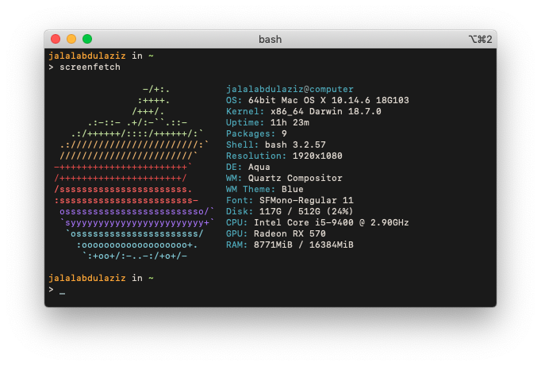

# System Specifications

## System Specifications

- **OS:** MacOS Mojave 10.14.6
- **Bootloader:** OpenCore 0.5.5
- **Motherboard:** Gigabyte B360N Wifi
  * Ethernet: 1x Intel I219-V7 Gigabit Ethernet + 1x Intel I211 Gigabit Ethernet
  * Audio Codec: Realtek ALC887 (Layout 1)
  * Wireless: Realtek 8822BE
  
- **CPU:** Intel i5 9400
- **GPU:** Sapphire RX 570 ITX 8GB
- **RAM:** Corsair Vengeance LPX 16GB 2x8GB DDR4 2666Mhz
- **STORAGE:** Adata XPG SX8200 PRO 512GB M.2 NVMe

## BIOS Settings

Disabled:
- Fast Boot
- VT-d
- CSM

Enabled:
- VT-x
- Above 4G decoding
- Hyper-Threading
- OS type: Windows 8.1/10 UEFI Mode

## Guides & Links

- [OpenCore Vanilla Desktop Guide](https://khronokernel-2.gitbook.io/opencore-vanilla-desktop-guide/)

## Known Issues

- Internal WiFi & Bluetooth are not supported.

## To Dos

- Replace internal WiFi > DW1560